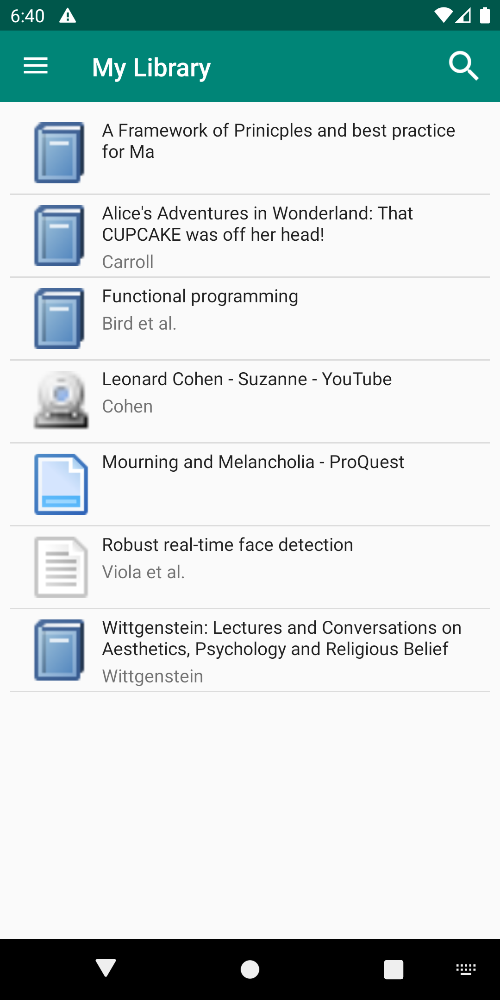
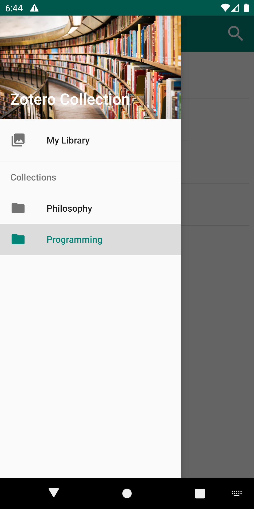
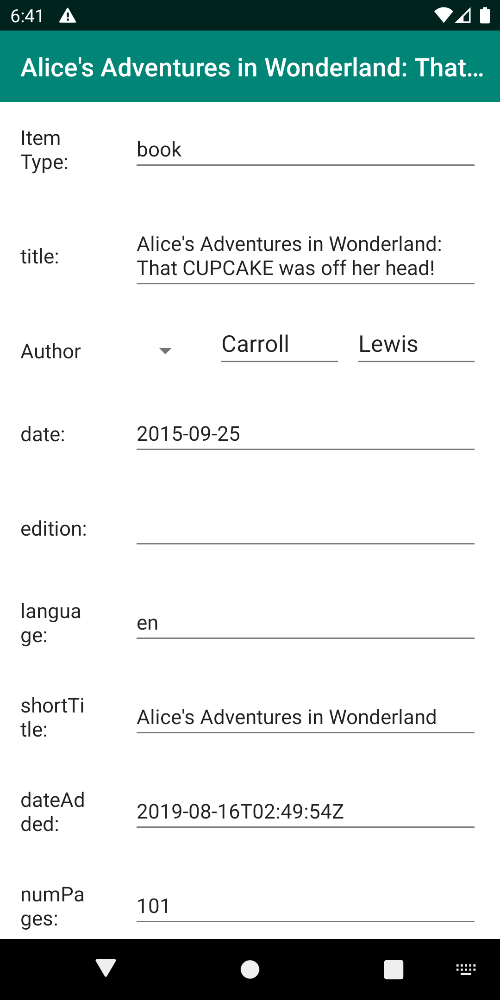

# Zoo for Zotero

Zoo for Zotero is an Android application for viewing zotero libraries.

  

## Features
  - Material Design
  - Support for catalogs
  - Allows for viewing of attached PDFs, with caching
  - Flexible searching of your library
  - Fast, native android implementation
  - Written in 100% kotlin using the MVP design pattern
  - Currently readonly, but have plans allow for editing in the future
  - Support for the Zotero Account Sync service with plans for cloudsharing providers in the future.

## How to Contribute
Any contributions, whether it be pull requests or even suggestions are welcome!
I am kind of busy but I will get to it!

## License
 * The application is released fully under GPLv3
 * This application is 100% Free with no ads!
 * We utilise graphical resources directly from the desktop zotero client.

Credits:
  - Michael Johnston <michael.johnston29@gmail.com>

This is a third party zotero client and is not affiliated with Zotero at all.